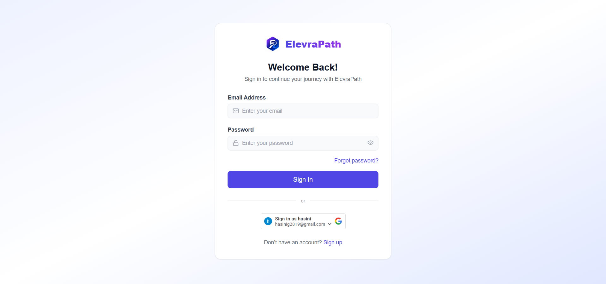
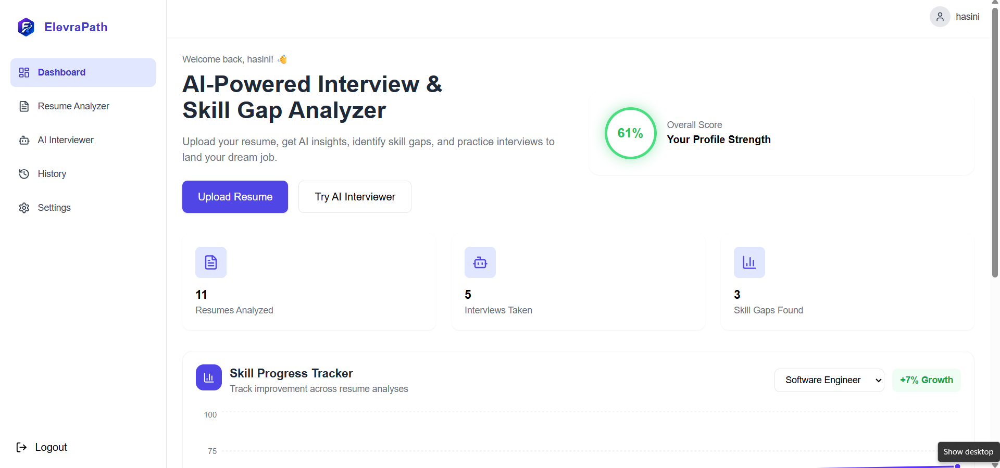
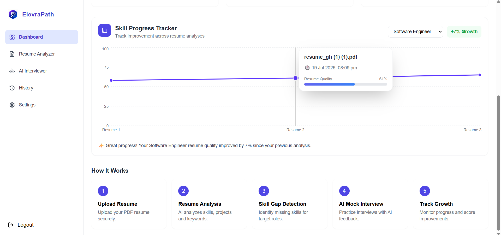
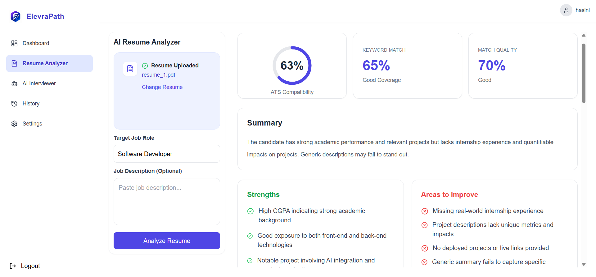
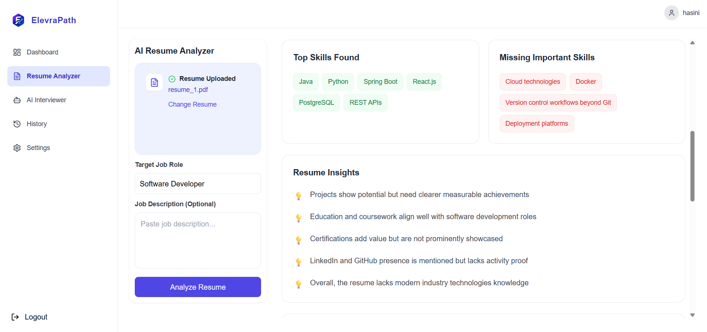
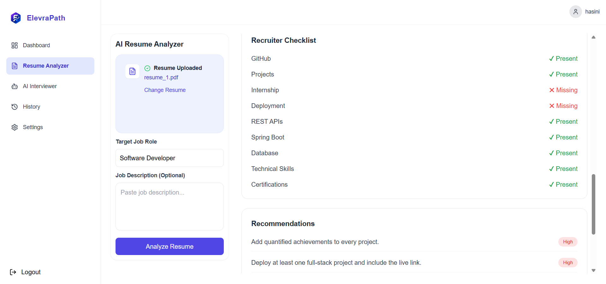
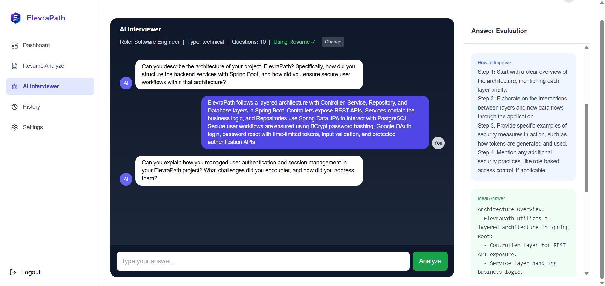
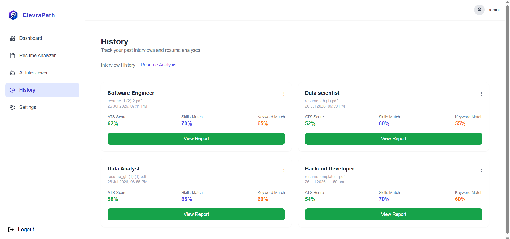
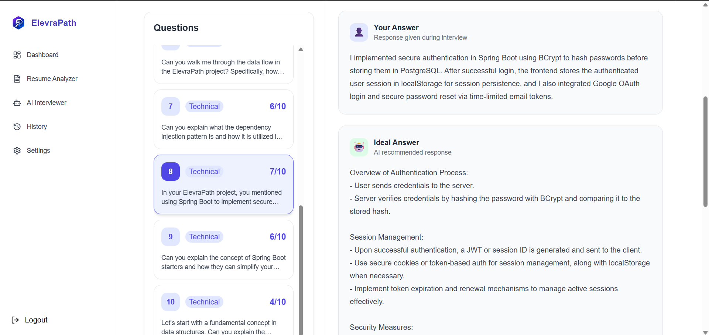
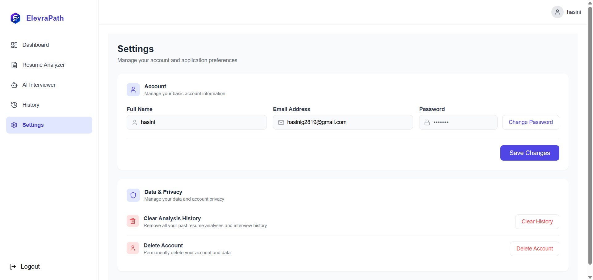

<h1 align="center">ElevraPath</h1>
<p align="center">
A full-stack AI-powered career preparation platform that helps users analyse resumes, identify skill gaps, and practise technical, behavioural, and project-based interviews using an AI interviewer. The platform provides personalised feedback, interview history tracking, and learning recommendations to help users prepare effectively for placements.
</p>
<p align="center">
   
</p>


---

<p align="center">
  <a href="https://elevra-path.vercel.app">
    
  </a>
</p>


---


## Screenshots

| Login | Dashboard |
|---|---|
|  |  |

| Dashboard (2) | Resume Analyzer|
|---|---|
|  |  |

| Resume Analysis (2) | Resume Analysis (3) |
|---|---|
|  |  |

| AI Interview | History |
|---|---|
| |  |

|  Interview Evaluation | Settings |
|---|---|
|  |   |


#  Key Features

-  **AI Resume Analysis**
   - Upload PDF resumes and analyse them against a target job role.
   - Identify technical strengths, missing skills, and improvement areas.

-  **AI-Powered Mock Interviews**
   - Conduct personalised mock interviews based on the selected job role.
   - Supports Technical, Behavioural, and Project-based interview modes.
   - Configurable interview length (10, 15, or 20 questions).

-  **Answer Evaluation**
   - Evaluates every response using AI.
   - Generates:
     - Interview Score
     - Personalised Feedback
     - Improved Answer Suggestions
     - Ideal Answer Reference

-  **Skill Gap Identification**
   - Detects missing skills by comparing resume content with the target role.
   - Generates personalised learning recommendations.

-  **Interview History**
   - Stores previous interview sessions.
   - View interview questions, answers, feedback, and overall performance.

-  **Secure Authentication**
   - Email & Password Authentication
   - Google OAuth Login
   - BCrypt Password Encryption
   - Forgot Password via Email
   - Password Reset using Secure Tokens

-  **User Profile Management**
   - Update profile information.
   - Change password securely.
   - Clear interview history.
   - Permanently delete account.
---
## Tech Stack

| Category | Technologies |
|---|---|
| **Frontend** | React.js, Vite, Tailwind CSS, Axios, React Router, Recharts, Lucide React, Google OAuth |
| **Backend** | Spring Boot, Spring MVC, Spring Data JPA, Spring Security, Hibernate, Maven |
| **Database** | PostgreSQL |
| **AI Integration** | OpenRouter API (GPT-3.5 Turbo) |
| **Auth & Security** | BCrypt, Google OAuth 2.0, Password Reset Tokens, SendGrid |
| **File Processing** | Apache PDFBox, iText PDF |
| **Dev Tools** | IntelliJ IDEA, VS Code, pgAdmin, Postman, Git, GitHub |

---
#  System Architecture

```text
                    User
                      │
                      ▼
        React + Vite + Tailwind CSS
                      │
                Axios REST API
                      │
                      ▼
              Spring Boot Backend
          ┌───────────┼───────────┐
          │           │           │
          ▼           ▼           ▼
   PostgreSQL     OpenRouter AI   PDF Resume Parser
     Database      (GPT-3.5)     (Apache PDFBox)
          │
          ▼
 Authentication • Resume Analysis • AI Interviews
 Interview History • Feedback • Recommendations
```
---

#  Folder Structure

```text
ElevraPath
│
├── ep-frontend
│   ├── public
│   ├── src
│   │   ├── assets
│   │   ├── components
│   │   ├── pages
│   │   ├── App.jsx
│   │   ├── main.jsx
│   │   └── index.css
|   ├── vercel.json
│   ├── package.json
│   └── vite.config.js
│
├── ep-backend
│   ├── src
│   │   ├── main
│   │   │   ├── java
│   │   │   │   └── com.hasini.ai_interview_analyzer
│   │   │   │       ├── controller
│   │   │   │       ├── service
│   │   │   │       ├── dto
│   │   │   │       ├── entity
│   │   │   │       ├── repository
│   │   │   │       ├── config
│   │   │   │       ├── security
│   │   │   │       └── util
│   │   │   └── resources
│   │   └── test
│   ├── pom.xml
│   └── mvnw
│
└── README.md
```
##  Getting Started

### Prerequisites

- Java 21
- Maven
- Node.js (v18 or above)
- PostgreSQL
- IntelliJ IDEA or VS Code

---

### Installation

#### 1. Clone the repository

```bash
git clone https://github.com/hasINI-123-006/ElevraPath.git
cd ElevraPath
#### 2. Backend Setup

```bash
cd ep-backend
mvn clean install
```

#### 3. Frontend Setup

```bash
cd ../ep-frontend
npm install
```

---

###  Environment Variables

Create the following file:

**Backend**

```text
ep-backend/src/main/resources/application.properties
```

Configure it with your own values:

```properties
spring.datasource.url=YOUR_DATABASE_URL
spring.datasource.username=YOUR_DATABASE_USERNAME
spring.datasource.password=YOUR_DATABASE_PASSWORD

openrouter.api.key=YOUR_OPENROUTER_API_KEY

sendgrid.api.key=YOUR_SENDGRID_API_KEY

google.client.id=YOUR_GOOGLE_CLIENT_ID
```

---

###  Running the Application

#### Start Backend

```bash
cd ep-backend
mvn spring-boot:run
```

Backend runs at:

```text
http://localhost:8080
```

---

#### Start Frontend

```bash
cd ep-frontend
npm run dev
```

Frontend runs at:

```text
http://localhost:5173
```

##  Future Enhancements

-  Voice-based AI interviews using Speech-to-Text and Text-to-Speech.
-  Camera-based interview mode with confidence and body-language analysis.
-  AI-generated learning roadmap with curated resources for missing skills.
